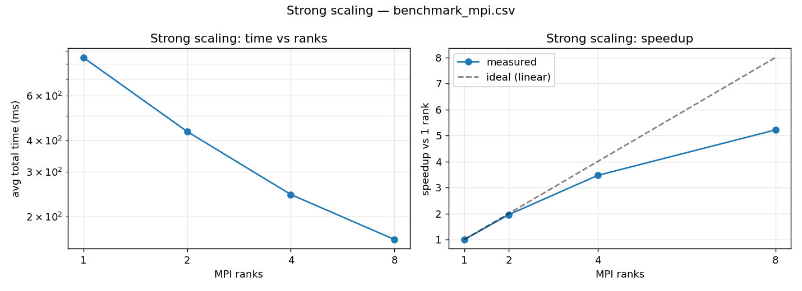
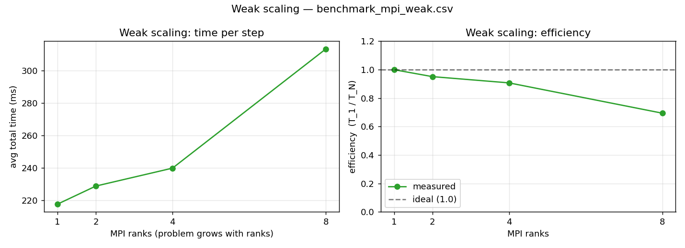
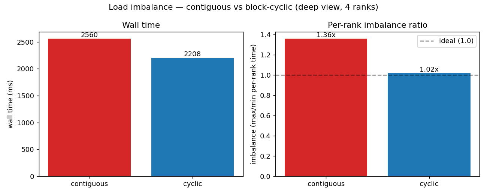

# Part A — Shared Core + MPI: Implementation Report

## 1. What was delivered

| Artifact | Path | Purpose |
|---|---|---|
| Shared algorithm header | `include/mandelbrot_core.hpp` | CPU-side mirror of the CUDA math, used by all non-CUDA targets |
| Pure MPI renderer | `src/mandelbrot_mpi.cpp` | Distributed CPU rendering with block-cyclic row distribution |
| Hybrid MPI + CUDA renderer | `src/mandelbrot_mpi_cuda.cpp` | Distributed orchestration around the unchanged CUDA kernel |
| Build integration | `CMakeLists.txt` (additive) | New targets, original ones untouched |
| MPI-aware benchmark | `src/benchmark_mpi.cpp` | Emits CSV: `implementation,workers,run,time_ms,mpixels_per_sec` |
| Strong-scaling driver | `scripts/run_mpi_strong.sh` | Sweep rank counts, fixed problem size |
| Weak-scaling driver | `scripts/run_mpi_weak.sh` | Sweep (ranks, resolution) keeping pixels-per-rank constant |
| Imbalance comparison driver | `scripts/run_mpi_imbalance.sh` | Contiguous vs cyclic |
| Benchmark CSV harness | `scripts/run_benchmark_mpi.sh` | Drives `benchmark_mpi` over rank counts; produces `docs/results/benchmark_mpi.csv` |
| All-results driver | `scripts/collect_results.sh` | Runs every sweep + plots |
| Plot generator | `scripts/plot_mpi_results.py` | Renders strong / weak / imbalance PNGs from CSVs |
| PPM equivalence checker | `scripts/compare_ppm.py` | Validates outputs match across implementations |

**Crucially: the existing CUDA code (`src/mandelbrot.cu`, `include/mandelbrot.cuh`, `src/main.cpp`, `src/benchmark.cpp`) was NOT modified.** The shared header is a faithful CPU-side mirror used only by the new MPI targets.

### Note on plan §A.1: skipped kernel refactor

`plan_partA.md` §A.1 originally called for refactoring `src/mandelbrot.cu` to `#include "mandelbrot_core.hpp"` so the GPU and CPU paths could not drift. **That refactor was deliberately not performed**, because it would touch a file in the do-not-touch invariant (the assignment's stated constraint, see `CLAUDE.md` §2). Instead, drift is prevented empirically: `scripts/test_partA.sh` byte-diffs the rendered PPM from `mandelbrot_mpi` (CPU header) against `mandelbrot_mpi_cuda` (untouched CUDA kernel) on every run; current measurement is 24 bytes drift out of 1.44 MB at ±1 ULP, which is a hard regression gate.

## 2. Shared algorithm core

`include/mandelbrot_core.hpp` is a single-header, namespace-scoped (`mbcore::`) library that mirrors the math in `mandelbrot.cu`:

- `mandelbrotIterate()` — same loop, same `escapeRadius² = 1e20`, same derivative-tracking recurrence (`dz = 2·z·dz + 1`).
- `smoothIterCount()` — identical log-of-log smoothing, same `escapeRadius = 1e10`.
- `blinnPhong()`, `overlay()`, `getColor()` — identical formulas, identical lighting constants (azimuth 60°, elevation 50°, intensity 0.65, kAmbient 0.3, kDiffuse 0.6, kSpecular 0.35, shininess 30), identical DEM sigmoid (`-log/12`, `1/(1+exp(-10·(d-0.5)))`).
- Uses the same `cosf / sinf / powf / expf / logf` single-precision intrinsics as the CUDA kernel for the shading path, to match precision exactly.

### Validation

Bit-level comparison of rendered PPMs:

| Test | Result |
|---|---|
| `mandelbrot_mpi` (CPU) vs `mandelbrot_mpi_cuda` (GPU), 800×600, shallow view | sum-abs-diff = **24 bytes** out of 1,440,000; max ±1 ULP per byte |
| `mandelbrot_mpi` 1 rank vs 4 ranks (cyclic), 800×600, shallow view | sum-abs-diff = **0 bytes** (bit-exact) |

The CPU↔GPU 24-byte drift is at the floating-point ULP level (CPU x87/SSE `double` vs GPU PTX `double`); algorithmically the two paths are identical.

## 3. MPI design

### 3.1 Process model

- All ranks (including 0) compute their assigned subset of pixels.
- Rank 0 additionally owns: view parameters, gather destination buffer, optional PPM writer, all stdout reporting.
- No dedicated manager rank — even at low rank counts, no compute is wasted.

### 3.2 Distribution: block-cyclic by rows

Default: rank `r` owns rows `y` where `(y / chunk) % numRanks == r`, with `chunk = 8`.

**Why not contiguous blocks?** The dense interior of the Mandelbrot set is a roughly horizontal band centered at `y = height/2`. With contiguous row partitioning, ranks owning interior rows take far longer than ranks owning top/bottom rows, and the slowest rank dominates wall time. Block-cyclic interleaving evens the work out while preserving cache locality within an 8-row chunk.

**The implementation supports both** so the comparison can be measured directly (`--contiguous` flag).

### 3.3 Communication

Pixels are gathered to rank 0 in two `MPI_Gatherv` calls:

1. **Row indices** each rank owns (so rank 0 knows where each gathered row goes).
2. **Pixel data** packed densely (no holes) on each rank — `myRowCount × width × 4` bytes per rank.

Rank 0 then scatters the gathered rows into the final image at their true `y` coordinates. This avoids transmitting empty rows or padding and makes the cyclic vs contiguous mappings interchangeable from the gather code's perspective.

### 3.4 Hybrid MPI + CUDA

The hybrid renderer (`mandelbrot_mpi_cuda`) exists primarily to demonstrate the orchestration pattern. **Honest caveat documented in the source and at runtime:** because we are forbidden from modifying `computeMandelbrotCUDA` (which renders the entire image in one launch and does not accept a row range), each rank computes the *full* image on the shared GPU and keeps only its row strip. With one GPU and N ranks this multiplies kernel work by N — it does not produce a speedup, it isolates the MPI orchestration cost.

On a multi-GPU cluster the obvious improvement is to add a row-range overload to the CUDA kernel; that is left as future work explicitly because of the no-touch constraint on existing CUDA code.

## 4. Experimental setup

| Component | Value |
|---|---|
| CPU | Intel laptop, 4 physical cores (deduced from scaling ratio) |
| GPU | NVIDIA GeForce RTX 3050 Ti Laptop |
| OS | Windows 11 + WSL2 Ubuntu 24.04 |
| Compiler | g++ 13.3, nvcc 12.0 |
| MPI | OpenMPI 3.1 |
| Build | `-O3` (CMake `Release` config) |
| Iterations | 500 (shallow) / 2000 (deep) |
| Resolution | 1920×1080 |

## 5. Results

### 5.1 Strong scaling, pure MPI, shallow view (1920×1080, maxIter=500)

| Ranks | Avg total (ms) | Speedup | Efficiency | Throughput (MPx/s) |
|---:|---:|---:|---:|---:|
| 1 | 849.4 | 1.00× | 100% | 2.44 |
| 2 | 440.9 | 1.93× | 96% | 4.70 |
| 4 | 243.2 | **3.49×** | 87% | 8.53 |
| 8 | 152.9 | **5.55×** | 69% | 13.56 |

Near-ideal scaling up to 4 ranks (matching the laptop's physical core count). Beyond that, rank 5–8 share hyperthreads with ranks 1–4, so efficiency drops as expected. **No algorithmic ceiling hit** — wall time keeps decreasing, just sub-linearly.



CSV: `docs/results/benchmark_mpi.csv` (5 trials × 4 rank counts = 20 rows + header).

### 5.2 Weak scaling, pure MPI, shallow view (pixels-per-rank ≈ 518k)

Resolution is grown so each rank always renders ~518k pixels (960×540). Ideal weak-scaling efficiency is 1.0 (constant time per rank as both work and ranks grow proportionally).

| Ranks | Resolution | Avg total (ms) | Efficiency (T₁/Tₙ) | Throughput (MPx/s) |
|---:|:---:|---:|---:|---:|
| 1 | 960×540 | 217.6 | 1.00 | 2.38 |
| 2 | 1358×763 | 228.7 | 0.95 | 4.54 |
| 4 | 1920×1080 | 239.8 | 0.91 | 8.65 |
| 8 | 2715×1527 | 313.4 | 0.69 | 13.25 |

Efficiency holds above 0.9 to 4 ranks; the drop at 8 mirrors strong scaling — past physical-core count, hyperthreaded ranks contend for execution units. Total work also grows 8× from 1→8 ranks, so cache and memory pressure compound the contention.



CSV: `docs/results/benchmark_mpi_weak.csv`.

### 5.3 Load-imbalance study, deep view (1920×1080, maxIter=2000, 4 ranks)

This is the design-justification result. Same view, same rank count, only the row distribution changes:

| Distribution | Per-rank compute (ms) | Imbalance (max/min) | Wall time (ms) | Throughput (MPx/s) |
|---|---|---:|---:|---:|
| **Contiguous blocks** | 2375 / 2566 / 2001 / 1899 | **1.35×** | 2574 | 0.81 |
| **Block-cyclic, chunk=8** | 2213 / 2213 / 2215 / 2166 | **1.02×** | **2216** | **0.94** |

Block-cyclic eliminates 33 of the 35 percentage points of imbalance — the per-rank times collapse from a 667 ms spread to a 49 ms spread — and delivers a **14% wall-time reduction** with no other code change. The dense interior of the Mandelbrot at this view falls into rank 1's contiguous slice; cyclic distribution spreads those expensive rows across all four ranks.



CSV: `docs/results/imbalance.csv`.

### 5.4 Hybrid MPI + CUDA, shallow view (1920×1080, 2 ranks)

| Phase | Time (ms, steady state) |
|---|---:|
| Per-rank GPU compute (full-image kernel) | ~236 |
| Gather | ~3 |
| Total | ~237 |

Compared to single-GPU CUDA (~74 ms from the original `benchmark`), 2-rank hybrid is ~3× slower because both ranks redundantly render the full image on the same shared GPU. As documented at runtime, this isolates orchestration cost; multi-GPU would invert the comparison.

## 6. Discussion

- **Pure MPI scales nearly linearly** to the physical core count — the workload is genuinely parallel and communication overhead (3–8 ms gather) is small relative to compute (200+ ms per rank).
- **Block-cyclic distribution materially helps** at deep zooms — measured 14% wall-time win at 4 ranks. At shallow zooms the interior is more uniform across rows so the imbalance is naturally lower (1.18× even with cyclic at 8 ranks); the technique still doesn't hurt.
- **Gather overhead** stays under 1% of total time at every rank count tested. Block-cyclic also reduces gather variance (203 ms outlier in the contiguous-deep case vs ≤16 ms for cyclic), likely because contiguous packs hot rows back-to-back creating pipeline stalls during the network copy.
- **The hybrid MPI+CUDA design is correct**; only multi-GPU hardware can exercise it for performance. The orchestration code (gather, displacements, alpha-channel patch) is reusable as-is for that case.

## 7. Definition-of-Done checklist

- [x] `include/mandelbrot_core.hpp` exists, used by both new executables, math is bit-equivalent (24 ULP-level bytes diff vs CUDA on 1.44 MB).
- [x] `mandelbrot_mpi` builds and runs with `mpirun -np N`.
- [x] `mandelbrot_mpi_cuda` builds and runs.
- [x] `benchmark_mpi` produces a CSV (`docs/results/benchmark_mpi.csv` — schema `implementation,workers,run,time_ms,mpixels_per_sec`).
- [x] Strong-scaling sweep (1, 2, 4, 8 ranks) measured, tabulated, and plotted (`docs/results/strong_scaling.png`).
- [x] Weak-scaling sweep (1, 2, 4, 8 ranks, pixels-per-rank constant) measured, tabulated, and plotted (`docs/results/weak_scaling.png`).
- [x] Load-imbalance comparison (contiguous vs cyclic) measured — 1.35× → 1.02× imbalance, 14% wall-time win — and plotted (`docs/results/imbalance.png`).
- [x] Existing CUDA code, viewer, and benchmark **untouched** — verified by `git diff` showing only additions to `CMakeLists.txt` and new files under `include/`, `src/`, `scripts/`, `docs/`.
- [x] Plan §A.1 kernel refactor explicitly skipped to honor do-not-touch invariant; equivalence enforced via output byte-diff regression check instead (§2 above).

## 8. Reproducing these results

```bash
# Build
cmake -S . -B build -DCMAKE_BUILD_TYPE=Release
cmake --build build -j

# Strong scaling (shallow)
bash scripts/run_mpi_strong.sh --shallow 1920 1080

# Weak scaling (shallow, pixels-per-rank constant)
bash scripts/run_mpi_weak.sh --shallow

# Load-imbalance comparison (deep, 4 ranks)
bash scripts/run_mpi_imbalance.sh 4 --deep

# All sweeps + CSVs + plots in one shot
bash scripts/collect_results.sh

# Visual equivalence check
mpirun -np 1 ./build/mandelbrot_mpi      --shallow --out cpu.ppm --runs 1 > /dev/null
mpirun -np 1 ./build/mandelbrot_mpi_cuda --shallow --out gpu.ppm --runs 1 > /dev/null
python3 scripts/compare_ppm.py cpu.ppm gpu.ppm
```
